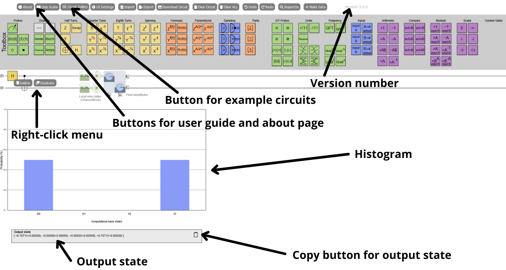
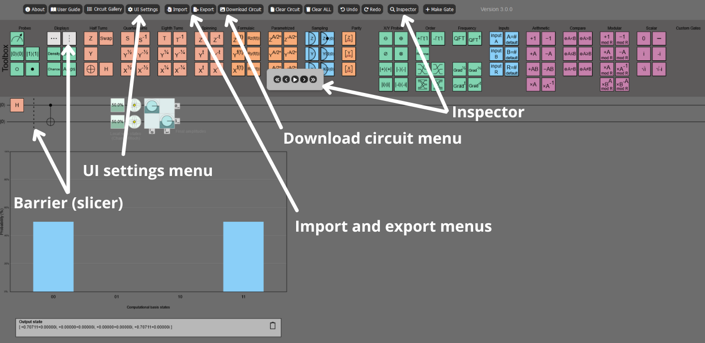

# Quirk-E

[Quirk-E](https://quirk-e.dev) is an open-source quantum circuit simulator built as an extended version of the original Quirk [[1](https://github.com/Strilanc/Quirk)] platform. Quirk-E has been developed as part of the <strong>Developer Experience in Iterative Quantum Software Engineering (DEQSE)</strong> project by the [Empirical Software Engineering Research Team](https://www.jyu.fi/en/research-groups/empirical-software-engineering-research) and the [QIC Team](https://www.jyu.fi/en/research-groups/quantum-information-and-computation-team) at the [University of Jyvaskyla](https://www.jyu.fi/en) in Finland.

The Quirk-E tool, which is presented in [[2](https://doi.org/), *Will be updated...*], adds more functionalities to the Quirk [[1](https://github.com/Strilanc/Quirk)] quantum circuit simulator.

Quirk-E is free-to-use and to modify. However, you must add reference [[2](https://doi.org/), *Will be updated...*] in case of any publication/production/execution/etc.

Quirk-E is also embedded in the DEQSE Visual Studio Code Extension, designed to enhance the quantum software development experience. The extension is available for download from [GitHub](https://github.com/DEQSE-Project/deqse-vscode-extension) and [Visual Studio Marketplace](https://marketplace.visualstudio.com/publishers/jyuqicteam).

Access Quirk-E via:

- **Web Browser:** [quirk-e.dev](https://quirk-e.dev/)

- **DEQSE Visual Studio Code Extension:** [GitHub Repository](https://github.com/DEQSE-Project/deqse-vscode-extension) | [Visual Studio Marketplace](https://marketplace.visualstudio.com/items?itemName=JYUQICTeam.deqse)

This work was supported by the Research Council of Finland [grant number [349945](https://research.fi/en/results/funding/70030)].

# Features

- **Dependencies have been updated** resolving several vulnerabilities caused by out-of-date packages.
- **Right-Click menu for gates** is added. It has "Duplicate" and "Delete" options.
- **Probability distribution histogram** is added.
- **Output state visualization and copying** is implemented below the histogram.
- **Dark and light modes** are added for enhancing the developer experience. These settings can be changed in the **UI Settings menu**.
- **Multi-colored, yellow-colored, and black & white UI coloring options** are available to take into account different user needs and use cases. These settings can be changed in the **UI Settings menu**.
- **UI enhancements** are made in order to make developer experience better. Dialogs and buttons have a unified style across the simulator interface.
- **Drag and drop barrier (Slicer)** for quantum circuits, enabling precise control over circuit execution flow by defining explicit synchronization points.
- **Download option** for downloading an image of the circuit is added, currently supporting PNG, JPEG, SVG, WebP, and PDF.
- **Import** functionality for importing circuits from other formats is added. Import currently supports Quirk-E JSON, OpenQASM 2.0, QUIL 2.0, Qiskit Qobj, and IonQ (JSON).
- **Export** functionality for exporting circuits to other formats is added. Export currently supports OpenQASM 2.0, Qiskit, PyQuil, Quil, Cirq, QuEST, QSharp, Qobj, Tensorflow Quantum, and Braket.
- **Inspector** allows user to control the flow of the circuit by playing it step by stepping, stepping between individual steps, and skipping to the beginning or end state of the circuit.

# Known issues

- **Some vulnerable dependencies** still remain due to some developer dependencies having vulnerable versions of `lodash` and `traceur` as sub-dependencies.

# Installation

Clone the repository.

`git clone https://github.com/DEQSE-Project/Quirk-E` 

`cd Quirk-E`

`npm install`

`npm run`

`npm run build`

Confirm the output works by opening out/quirk.html with a web browser.

# Contributors

- Samuel Ovaskainen ([@0wsk](https://github.com/0wsk)) - *University of Jyvaskyla*
- Majid Haghparast ([@MajidHaghparast](https://github.com/MajidHaghparast)) - *University of Jyvaskyla*
- Ronja Heikkinen ([@ronjahoo](https://github.com/ronjahoo)) - *University of Jyvaskyla*
- Julian Fuchs ([@julian-fuchs](https://github.com/julian-fuchs)) - *University of Jyvaskyla, Hasso Plattner Institute / University of Potsdam*

# Contact

Majid Haghparast <<majid.m.haghparast@jyu.fi>>

# References

[1] https://github.com/Strilanc/Quirk

[2] https://doi.org/ (*Will be updated...*)
