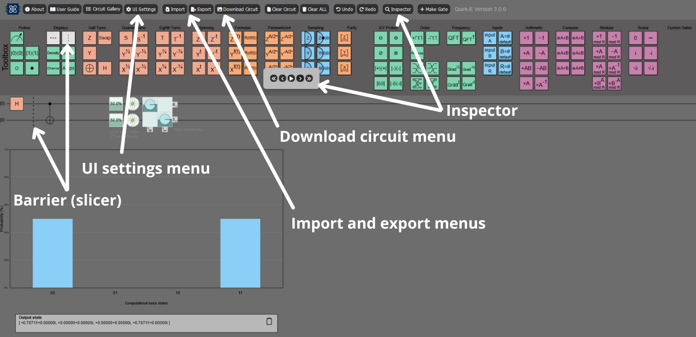
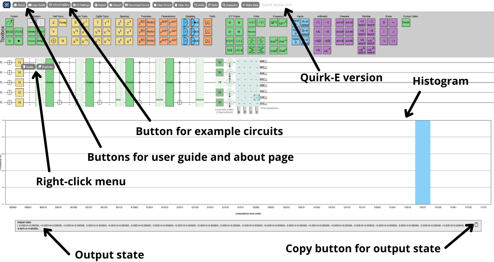

# Quirk-E User Guide

## Introduction

[Quirk-E](https://quirk-e.dev) is an open-source quantum circuit simulator built as an extension of the original [Quirk](https://github.com/Strilanc/Quirk) platform.  
Quirk-E has been developed as part of the **Developer Experience in Iterative Quantum Software Engineering (DEQSE)** project by the [Empirical Software Engineering Research Team](https://www.jyu.fi/en/research-groups/empirical-software-engineering-research) and the [QIC Team](https://www.jyu.fi/en/research-groups/quantum-information-and-computation-team) at the [University of Jyväskylä](https://www.jyu.fi/en) in Finland.

The Quirk-E tool adds more functionalities to the Quirk quantum circuit simulator. Quirk-E is free-to-use and modify, but you must provide reference in case of any publication. Quirk-E is also embedded in the DEQSE Visual Studio Code Extension, designed to enhance the quantum software development experience. The extension is available for download from [GitHub](https://github.com/DEQSE-Project/deqse-vscode-extension) and [Visual Studio Marketplace](https://marketplace.visualstudio.com/publishers/jyuqicteam).

## Quirk User Guide

Since Quirk-E is developed on top of the original Quirk, the [Quirk User Guide](https://github.com/Strilanc/Quirk/wiki/How-to-use-Quirk) is fully applicable to Quirk-E as well.

## Right-click Menu

By right-clicking a gate on a circuit, you will open a context menu. In that menu, you have two options: duplicate gate and delete gate. When you press the *Duplicate* button, the same gate appears next to the current gate. When you press the *Delete* button, the gate is deleted from the circuit.

## Probability Distribution Histogram

Below the circuit, there is a probability distribution histogram. The histogram shows the computational basis states and the probability for each possible state. It is updated in real-time.

## Output State

Below the histogram, there is a text box for the output state. It shows the complete output state as an array. In the box's top right corner, there is an icon button for copying the output state. The output state is copied to the clipboard in the same format as shown in the text box.

## UI Customization

For UI customization, light and dark modes are available:

- **Dark Mode**: A grey and muted color scheme, comfortable for long usage and less straining for the eyes.
- **Light Mode**: A classic bright theme.

This UI mode can be changed in the UI Settings menu, using the sun and moon icon buttons. The UI updates immediately when the icons are clicked.

In the same UI Settings menu, there are UI coloring options available. Three coloring modes are implemented:

1. **Multi-colored UI**: Multiple colors are used, and gates are colored based on groups.
2. **Yellow UI**: All the gates and histogram bars are yellow.
3. **Black and White UI**: Greyscale colors are used.

There are six different UI options:

- Dark and multi-colored
- Dark and yellow-colored
- Dark and greyscale
- Light and multi-colored
- Light and yellow-colored
- Light and greyscale

Other UI improvements include an updated sans-serif font, improved button designs, the DEQSE project logo, and combined toolboxes at the top of the interface.

## Slicer / Barrier

The **Slicer gate** is added to enhance circuit readability. With the slicer gate, the circuit can be divided into steps or parts, making the circuit easier to understand.

## User Interface Previews

**Dark Mode UI:**

**Light Mode UI:**

